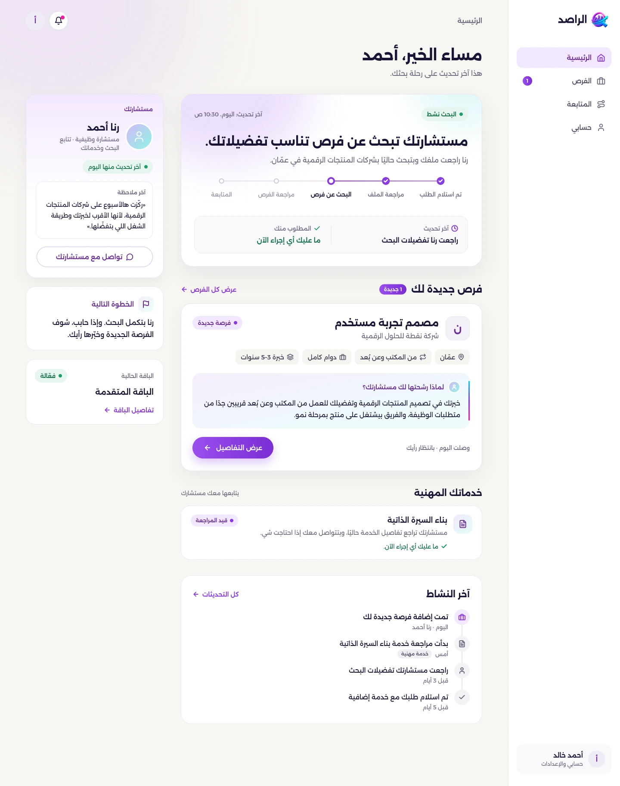

# الراصد — Alrased | UX/UI Redesign Presentation

عرض تقديمي تفاعلي عالي الجودة لإعادة تصميم منتج **الراصد (Alrased)** — منصة وخدمة بحث عن عمل يقودها مستشار بشري وتدعمها شفافية رقمية.



---

## 🌟 رؤية المنتج والتصميم (Product & Design Vision)

الهدف من هذا العرض ليس فقط إظهار واجهات جميلة، بل شرح **القيمة الحقيقية لإعادة التصميم** وتحديد العلاقة بين المستشار والباحث عن عمل وفريق العمليات:

- **خدمة بشرية + وضوح رقمي**: المنتَج لا يستبدل المستشار، بل يوضح عمله ويجعل التقدم ملموسًا.
- **تفسير القرار قبل وصف الوظيفة**: الإجابة عن السؤال المحوري: *«ليش مستشارك اختار هاي الفرصة؟»*.
- **لغة واحدة وتفاعل مرن**: دعم كامل للغة العربية والاتجاه من اليمين إلى اليسار (RTL) عبر مختلف الأجهزة.

---

## 📌 المحاور والشاشات المغطاة (Key Presented Areas)

1. **الصفحة الرئيسية (Homepage)**: شرح نموذج الخدمة، الدعم، خطوات الطلب، الأسئلة الشائعة والباقات.
2. **الطلب الكامل (Full Onboarding)**: 6 خطوات تفاعلية (الهدف، المكان، الخبرة/البديل اليدوي، التفضيلات، الدعم الاختياري، والمراجعة والتأكيد).
3. **لوحة العميل (Client Dashboard)**: إجابة مباشرة عن *"شو بصير هلا؟"* وحالات البحث والإجراءات المطلوبة.
4. **قائمة الفرص (Opportunities List)**: الفرص الحالية والسابقة مع حالات التصفية والسياق.
5. **تفاصيل الفرصة (Opportunity Detail)**: التركيز على تفسير المستشار قبل وصف الوظيفة.
6. **حالات التفاعل والقرار (Decision States)**:
   - **مهتم** (Interested)
   - **أحتاج توضيحًا** (Need Clarification)
   - **غير مناسبة** (Not Suitable)
   - إضافة إلى حالات التقديم والمقابلة.
7. **المتابعة والشفافية (Follow-up & Tracking)**: توزيع المسؤولية (مطلوب منك / بانتظار الراصد) والتحديثات والخطوة التالية.
8. **الخدمات المهنية (Professional Services)**: بناء السيرة الذاتية وتجهيز المقابلات ضمن مسار واحد.
9. **تجربة الجوال (Mobile Experience)**: شاشات مخصصة للهواتف مع أزرار لمس مريحة ولوحات سفلية تفاعلية.
10. **نظام التصميم (Design System)**: الألوان (#8B3AE5 / #181535 / #F6F4EF)، خط Alexandria، المسافات والحالات.
11. **لوحة المدير وفريق العمليات (Manager & Team Dashboards)**: متابعة حمل الفريق، التعيين، والمهام اليومية للمستشار.
12. **قدرة الذكاء الاصطناعي المستقبلية (Future AI Search)**: معروضة بوضوح كـ *قدرة مستقبلية مصممة فقط وغير منفذة حاليًا*.

---

## 🛠️ التشغيل المحلي (Local Running)

العرض مبني بتقنيات الويب القياسية (HTML5 / CSS3 / Vanilla JS) ولا يحتاج إلى تثبيت حزم أو أدوات معقدة:

```bash
# تشغيل خادم محلي باستخدام Python
python -m http.server 8080
```

افتح المتصفح على العنوان: `http://localhost:8080`

---

## 📁 هيكلة المشروع (Repository Structure)

```
├── index.html            # الصفحة الرئيسية للعرض التفاعلي
├── style.css             # الهيكل والتنسيقات الأساسية
├── chapters.css          # تنسيقات الفصول والأقسام
├── refinements.css       # تحسينات التفاعل والعرض
├── mobile-fixes.css      # تجاوب الشاشات الصغيرة والجوال
├── app.js                # المنطق التفاعلي (التنقل، التكبير، الحالات)
├── content.js            # المحتوى والنصوص والشاشات التوضيحية
├── assets/               # صور الشاشات والخطوط بصيغ عالية الضغط (WebP/TTF)
├── work/                 # مستندات التدقيق والسكربتات المساعدة
└── alrased/              # مجلد الحزم والتكامل
```

---

## 📄 الترخيص والاعتمادات (Notes & Credits)

- الشاشات والبيانات والأسماء المعروضة نماذج توضيحية مصممة لاختبار وتجسيد التجربة.
- حقوق خط **Alexandria** محفوظة لمصمميه ومتاح تحت رخصة الأوفن فونت.
